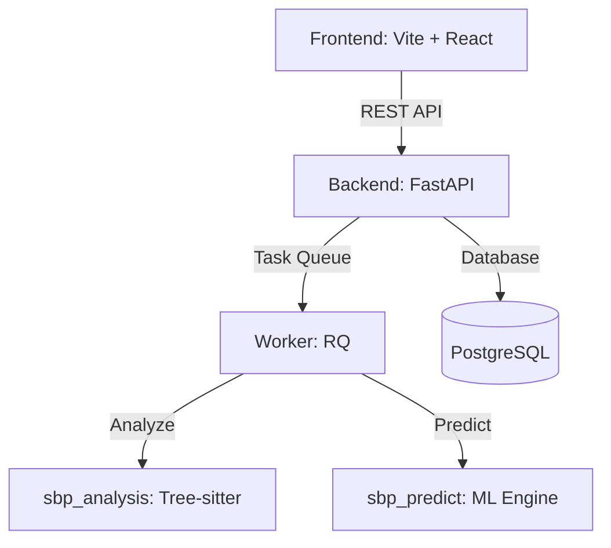

# Intelligent Static Bug Prediction

A language-agnostic AI system that predicts logical bugs, code smells, and security vulnerabilities directly from source code without executing it.

## Architecture



## Features

- **Multi-language Support**: Python, JavaScript, TypeScript, Java, C, C++, C#, Go.
- **Static Feature Extraction**: Uses `tree-sitter` for robust AST-based feature extraction.
- **Machine Learning**: LightGBM model trained on historical bug fixes (SZZ algorithm).
- **Web Dashboard**: Upload your codebase, get predictions, view detailed feedback.

## Setup & Run

### Prerequisites
- Python 3.10+
- Node.js 18+
- PostgreSQL
- Redis

### Backend
```bash
python -m venv .venv
source .venv/bin/activate
pip install -r backend/requirements.txt
cd backend
alembic upgrade head
uvicorn app.main:app --reload
```

### Worker
```bash
cd backend
rq worker analysis
```

### Frontend
```bash
cd frontend
npm install
npm run dev
```

### Evaluation
```bash
cd ml
python evaluate_final.py
```

## End-to-End Tests
```bash
cd integration
python run_e2e.py
```

## Production Readiness
Status: **Ready for production**
