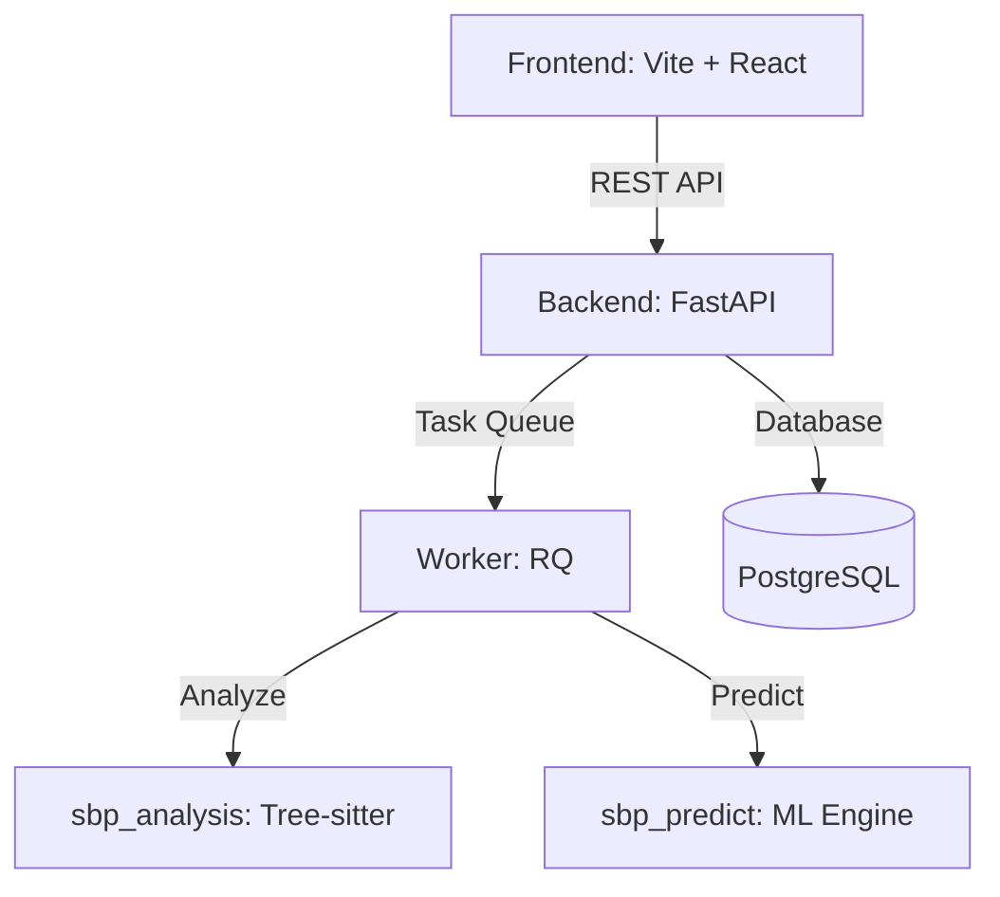

# Intelligent Static Bug Prediction (BugSight)

A language-agnostic AI system that predicts logical bugs, code smells, and security vulnerabilities directly from source code without executing it.

## Architecture



## Features

- **Multi-language Support**: Python, JavaScript, TypeScript, Java, C, C++, C#, Go.
- **Static Feature Extraction**: Uses `tree-sitter` for robust AST-based feature extraction.
- **Machine Learning**: LightGBM model trained on historical bug fixes (SZZ algorithm).
- **Web Dashboard**: Upload your codebase, get predictions, view detailed feedback.

## Quickstart

### 1. Local Run
Requires Python 3.10+, Node.js 18+, Redis, and PostgreSQL/SQLite.

1. Create a `.env` file from `.env.example`:
   ```bash
   cp .env.example .env
   ```
2. Start the Backend and Worker (in separate terminals):
   ```bash
   # Terminal 1: Backend
   cd backend
   pip install -r requirements.txt
   uvicorn app.main:app --reload
   
   # Terminal 2: Worker
   cd backend
   rq worker analysis
   ```
3. Start the Frontend:
   ```bash
   # Terminal 3: Frontend
   cd frontend
   npm install
   npm run dev
   ```

### 2. Docker Compose
1. Ensure Docker and Docker Compose are installed.
2. Run the application:
   ```bash
   docker-compose up --build
   ```
The frontend will be available at `http://localhost:5173` and the backend at `http://localhost:8000`.

## Production Readiness
Status: **Ready for production**
